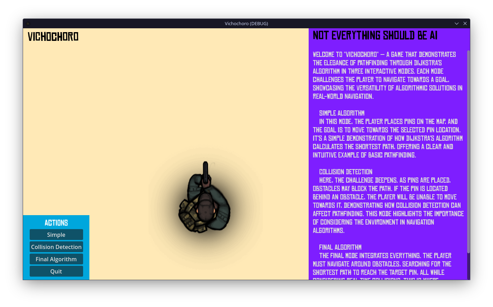

# Vichochoro: A* Algorithm in Action



Welcome to **Vichochoro** — a game that demonstrates the elegance of pathfinding through the A* Algorithm in three interactive modes. Each mode challenges the player to navigate towards a goal, showcasing the versatility of algorithmic solutions in real-world navigation.

## Project Overview

This project highlights the power and efficiency of the A* Algorithm through three distinct modes:

### 1. Simple Algorithm
In this mode, the player places pins on the map, and the goal is to move towards the selected pin location. It’s a simple demonstration of how the A* algorithm calculates the shortest path, offering a clear and intuitive example of basic pathfinding.

### 2. Collision Detection
Here, the challenge deepens. As pins are placed, obstacles may block the path. If the pin is located behind an obstacle, the player will be unable to move towards it, demonstrating how collision detection can affect pathfinding. This mode highlights the importance of considering the environment in navigation algorithms.

### 3. Final Algorithm
The final mode integrates everything. The player must navigate around obstacles, searching for the shortest path to reach the target pin, all while considering real-time collisions. This is where the A* algorithm truly shines, providing a solution for dynamic, real-world navigation that adapts to changing conditions.

## Getting Started

### Prerequisites
Before you begin, ensure you have met the following requirements:
- You have installed [Godot Engine](https://godotengine.org/download) (version 3.2 or later).
- You have a basic understanding of A* Algorithm and pathfinding principles.

### Installation
To install **Vichochoro**, follow these steps:

1. Clone the repository:
	```sh
	git clone https://github.com/yourusername/vichochoro.git
	```
2. Open the project in Godot Engine:
	- Launch Godot Engine.
	- Click on **Import**.
	- Navigate to the cloned repository folder.
	- Select the `project.godot` file.
	- Click **Open** and then **Edit**.

### Usage
To use **Vichochoro**, follow these steps:

1. Launch the game from Godot:
	- Click on the **Play** button or press `F5`.
2. Choose one of the three modes:
	- **Simple Algorithm**: Place pins on the map and see the algorithm in action.
	- **Collision Detection**: Place pins and observe how obstacles affect the pathfinding.
	- **Final Algorithm**: Navigate around obstacles in real-time to reach the target pin.
3. Follow the on-screen instructions to place pins and navigate the map.

## How it Works

### A* Algorithm
The A* (A-star) algorithm is a popular and efficient pathfinding algorithm used in many applications. It finds the shortest path between two points by considering both the cost to reach a point and the estimated cost to get from that point to the destination.

### Key Components
- **Open List**: Nodes to be evaluated.
- **Closed List**: Nodes already evaluated.
- **Heuristic Function**: Estimates the cost to reach the target from a given node.
- **Cost Function**: Actual cost from the start node to a given node.

### Steps
1. Start with the initial node.
2. Evaluate the neighboring nodes and calculate their costs.
3. Add neighboring nodes to the open list.
4. Move the current node to the closed list.
5. Select the node with the lowest cost from the open list and repeat until the target node is reached.

## Contributing

We welcome contributions! Please follow these steps to contribute:

1. Fork the repository.
2. Create a new branch (`git checkout -b feature/your-feature-name`).
3. Make your changes.
4. Commit your changes (`git commit -m 'Add some feature'`).
5. Push to the branch (`git push origin feature/your-feature-name`).
6. Create a pull request.

Please ensure your code adheres to the project's style guidelines and includes relevant documentation.

## License

This project is licensed under the MIT License. See the [LICENSE](LICENSE) file for details.

## Acknowledgements

- Inspired by classic pathfinding algorithms and their applications in game development.
- Special thanks to the Godot community for their support and resources.
- Appreciation to all contributors who help improve this project.

## Contact

If you have any questions or feedback, please don't hesitate to reach out. You can contact the project maintainer at [erick](mailto:hearteric57@gmail.com).

---

Feel free to reach out with any questions or feedback. Enjoy the journey through the pathways of **Vichochoro**!
